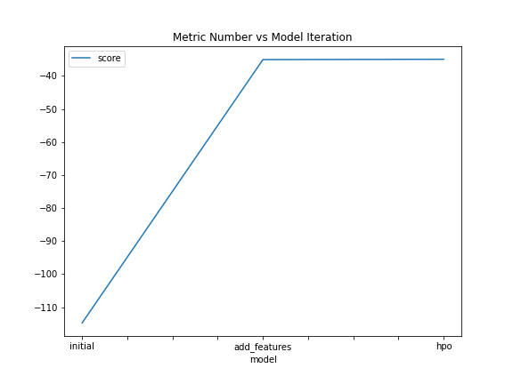
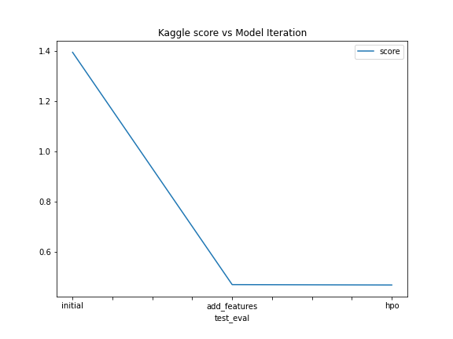

# Report: Predict Bike Sharing Demand with AutoGluon Solution
#### DEEPA BALAKRISHNAN

## Initial Training
### What did you realize when you tried to submit your predictions? What changes were needed to the output of the predictor to submit your results?
There were almost 3 predictions which had negative value. To submit successfully to Kaggle, I had to reset these predictions to 0.

### What was the top ranked model that performed?
From the fit_summary(), it is evident that WeightedEnsemble_L3 had the highest score_val (score_val = -114.737864)

## Exploratory data analysis and feature creation
### What did the exploratory analysis find and how did you add additional features?
After performing the exploratory analysis, found that dataset contains datetime feature. Algorithm will not understand datetime variable, hence need to extract information like year, month, day, hour from datetime. After parsing datetime strings to datetime, we can use the dt.year, dt.month, dt.day, dt.hour to create additional features like year, month, day, hour respectively.

Also modified the season and weather features to category DType, since these are int representation of category and for Autogluon to recognize this as category, need to modify their dtype to category.

### How much better did your model preform after adding additional features and why do you think that is?
After preforming predictions on the dataset with additional features, found that the top ranked model is WeightedEnsemble_L3 with score_val = -35.065935. I think adding additional features improved the model because:

   1. By comparing this to the previous, it is evident that RMSE value reduced from -114.737864 to -35.065935.

   2. Also there were no negative values in the prediction results.

## Hyper parameter tuning
### How much better did your model preform after trying different hyper parameters?
Firstly, done HPO by changing time_limit to 720 seconds. The score_val for this model is -34.955167, which is lower than the previous model(mentioned above). The predictions also did not include any negative values. The kaggle score for this model is 0.46668.

Secondly, added the following num_bag_folds = 6, num_stack_levels = 2, with time_timit=720
The num_bag_folds was introduced to mention the number of folds used for bagging of models.
The num_stack_levels was introduced to mention the number of stacking levels to use in stack ensemble.
This model had a score_val of -35.373953.

### If you were given more time with this dataset, where do you think you would spend more time?
I would spend more time in Feature Engineering some of the columns like temp and atemp by scaling to have a mean of 0.

### Create a table with the models you ran, the hyperparameters modified, and the kaggle score.
|model|time_limit|num_bag_folds|num_stack_levels|score|
|--|--|--|--|--|
|initial|600|NA|NA|1.39587|
|add_features|600|NA|NA|0.46823|
|hpo|720|NA|NA|0.46668|

### Create a line plot showing the top model score for the three (or more) training runs during the project.

### Create a line plot showing the top kaggle score for the three (or more) prediction submissions during the project.

## Summary
After preforming different types of model training, found that the model which had minimum RMSE was when time_limit was set to 720 seconds. Also this model did not have any predictions which were negative. My goal here was to minimize the RMSE value.